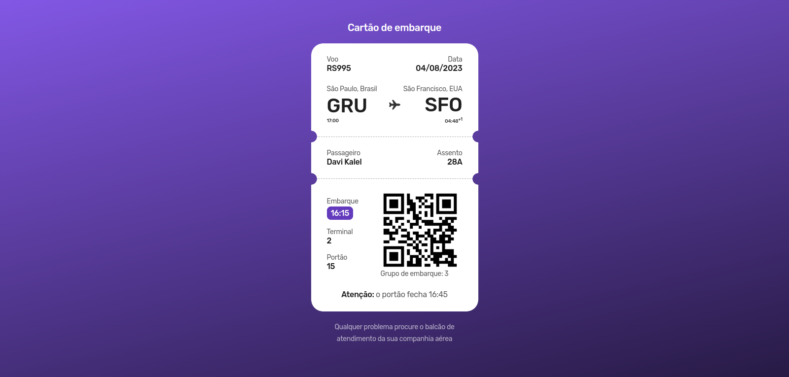

<h1 align="center">✈️ Cartão de Embarque</h1>

    
    

 

    

<strong><small>#boracodar um cartão de embarque</small></strong>

<h2>&#X1F4C1 Acess project</h2>

This page is hosted on GitHub pages, you can acess it through <a href="https://dkat-davi.github.io/bora-codar/boarding-pass/" target="_blank">this link</a>

<h2>&#X2714 Used techniques and tecnologies</h2>

  
     
    

          
[)](https://www.linkedin.com/in/dkat-davi/)

